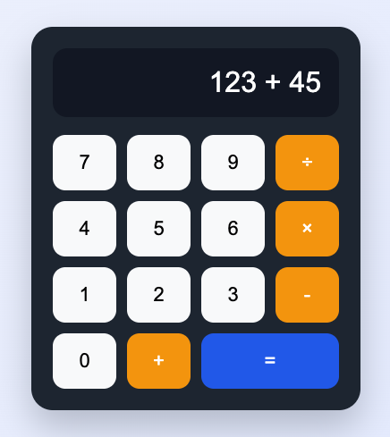

# 3주차 - CSS 기초 1: 문법과 선택자

## 이번 주 목표

- CSS가 HTML과 어떤 역할 차이가 있는지 설명할 수 있다.
- 선택자, 속성, 값의 구조를 이해할 수 있다.
- HTML 파일에 CSS를 연결할 수 있다.

## 왜 이 실습을 하나요?

HTML만으로도 내용을 만들 수 있지만, 화면이 단조롭고 읽기 어려울 수 있습니다.
CSS를 배우면 같은 내용도 더 보기 좋고, 더 구분하기 쉬운 형태로 만들 수 있습니다.

## 준비물

- VS Code
- 브라우저
- `03-css/example/calculator-design/index.html`
- `03-css/example/calculator-design/style.css`

## 이번 주 파일 설명

- `03-css/example/calculator-design/index.html`: 계산기 모양의 HTML 구조입니다.
- `03-css/example/calculator-design/style.css`: 계산기 화면을 꾸미는 스타일 파일입니다.

## 코드에서 꼭 볼 부분

- `선택자`: 어떤 요소를 꾸밀지 지정합니다.
- `속성`: 무엇을 바꿀지 적습니다.
- `값`: 어떻게 바꿀지 적습니다.
- `link rel="stylesheet"`: HTML과 CSS를 연결하는 코드입니다.

## 실습 순서

1. `03-css/example/calculator-design/index.html`과 `03-css/example/calculator-design/style.css`를 같이 엽니다.
2. 버튼과 화면 영역이 어떤 클래스를 쓰는지 확인합니다.
3. 글자 크기와 배경색을 바꿔봅니다.
4. 저장 후 브라우저에서 스타일이 바뀌는지 확인합니다.

## 학생 실습 미션

1. 계산기 바깥 배경색을 바꿔봅니다.
2. 버튼 색상을 원하는 색으로 수정합니다.
3. 화면 글자 크기를 더 크게 만들어봅니다.

## 체크리스트

- [ ] CSS 파일이 HTML과 연결되어 있다.
- [ ] 선택자, 속성, 값의 구조를 읽을 수 있다.
- [ ] 최소 2개 이상의 스타일을 직접 수정했다.

## 자주 하는 실수

- CSS 파일 연결을 빼먹는 경우
- 속성과 값 사이에 `:`를 빼먹는 경우
- 규칙 블록의 중괄호를 닫지 않는 경우

## 한 줄 정리

CSS의 시작은 "무엇을 꾸밀지"와 "어떻게 꾸밀지"를 분리해서 생각하는 것입니다.
