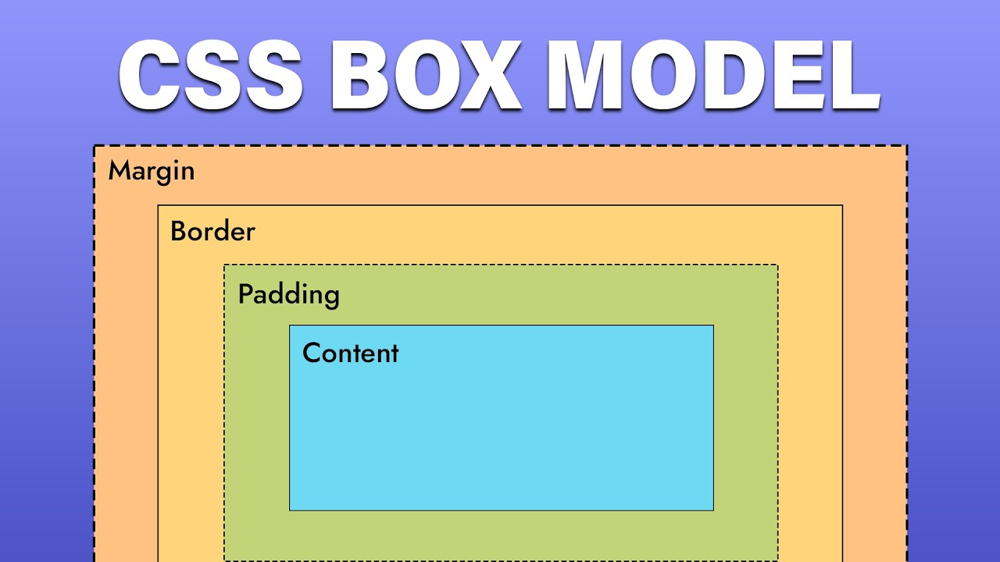

# 3주차 - CSS 기초 2: 박스 모델과 여백

## 이번 주 목표

- 박스 모델 개념을 이해할 수 있다.
- `margin`, `padding`, `border`의 차이를 설명할 수 있다.
- 요소 사이 간격을 조절할 수 있다.

## 왜 이 실습을 하나요?

웹페이지가 어색해 보이는 가장 흔한 이유 중 하나는 여백이 정리되지 않았기 때문입니다.
박스 모델을 이해하면 왜 요소가 붙어 보이거나 너무 떨어져 보이는지 설명할 수 있습니다.

## 준비물

- VS Code
- 브라우저
- `03-css/example/calculator-design/style.css`

## 이번 주 파일 설명

- `03-css/example/calculator-design/style.css`: 계산기 카드, 화면, 버튼 사이의 간격을 조절하는 파일입니다.

## 코드에서 꼭 볼 부분

- `margin`: 요소 바깥 여백입니다.
- `padding`: 요소 안쪽 여백입니다.
- `border`: 테두리입니다.
- `width`, `height`: 크기를 정하는 속성입니다.

## 실습 순서

1. 계산기 카드의 바깥 크기와 안쪽 여백을 확인합니다.
2. 버튼 사이 간격이 어디에서 만들어지는지 찾습니다.
3. `padding`과 `margin` 값을 바꿔봅니다.
4. 화면 모양이 어떻게 달라지는지 관찰합니다.

## 학생 실습 미션

1. 계산기 카드의 안쪽 여백을 더 크게 만들어보세요.
2. 버튼 사이 간격을 줄이거나 늘려보세요.
3. 화면 영역에 테두리를 추가해보세요.

## 체크리스트

- [ ] `margin`과 `padding`의 차이를 설명할 수 있다.
- [ ] 버튼이나 카드의 간격을 직접 수정했다.
- [ ] 값이 달라졌을 때 화면 변화가 보인다.

## 자주 하는 실수

- `margin`과 `padding`을 같은 뜻으로 이해하는 경우
- 테두리 두께를 줬는데 색을 지정하지 않아 안 보이는 경우
- 숫자 값 뒤에 단위를 빼먹는 경우

## 한 줄 정리

박스 모델은 CSS 레이아웃을 읽는 기본 언어입니다.
